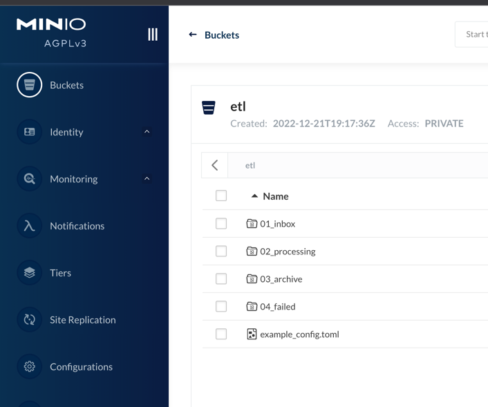
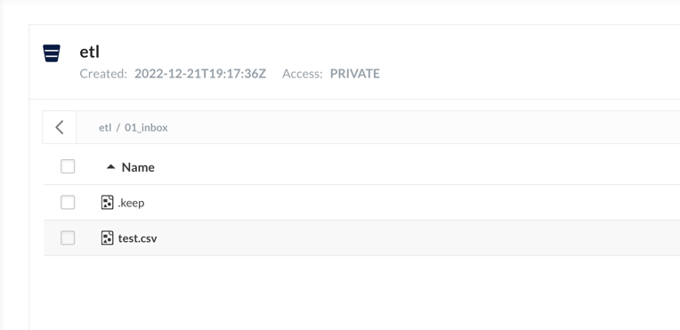
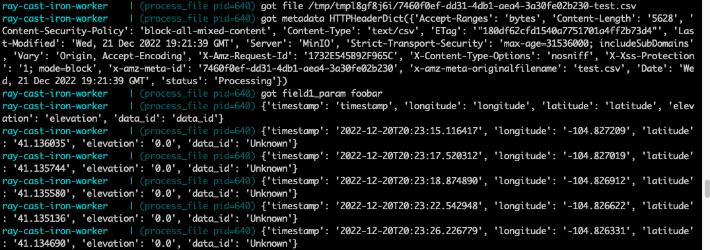

# Ray Cast-Iron Worker Example (ray-worker)

Ray Worker is build on top of [Ray Core](https://ray-robert.readthedocs.io/en/latest/internals-overview.html), a distributed execution
engine to offload compute intensive work as remote functions to remote worker process threads. The primary function of Ray Worker is
to associate a TOML config to match a data file to a Python entry processing method, which itself is then executed as a Ray remote function
on a cluster.

Ray Worker also uses an Object Store to persist and stage files for processing, as well as a PostGres Database to track file status as it
is being processed, in addition, high level file status and progress are also exposed via Kafka as optional integration point.

## Getting Started

This Ray Cast-Iron Worker example leverages several Python libraries to accomplish distributed File workflow
* [Ray](https://ray.io)
* [Kafka](https://github.com/dpkp/kafka-python)
* [Minio](https://docs.min.io/docs/python-client-api-reference.html)
* [Pydantic](https://pydantic-docs.helpmanual.io/)
* [Toml](https://github.com/uiri/toml)
* [Postgres](https://www.postgresql.org/)

## Installing Dependencies

* Install Python 3.9, preferably using [Pyenv](https://github.com/pyenv/pyenv)
```bash
$ pyenv install
```
* This project utilizes [Poetry](https://python-poetry.org/docs/#installation) for managing python dependencies.
```bash
$ curl -sSL https://raw.githubusercontent.com/python-poetry/poetry/master/get-poetry.py | python
```
* Install dependencies
```bash
$ make install
```

## Start the Project

Run
`make up`


## Stop the Project

Run
`make clean`

## Other avaiable commands

Run
`make`
to view commands available for this project

## S3 Compliant Object Store Backed File Workflow

### Example workflow

With the docker containers running and the worker running in either a container or locally
1. Navigate to MinIO `http://localhost:9001`, login using cred as configured in project.env
2. Add `etl/example/example_config.toml` to the `etl` bucket
3. Refresh the page to verify that additional etl buckets are created

4. Navigate into `01_inbox`
5. Add `etl/example/test.csv`

6. Observe the log for Ray Cast Iron Worker
```docker logs -f ray-cast-iron-worker```

The configured example processor will simply output the file you just dropped

8. The test.csv file will also be moved to the `archive_dir` bucket

### Matching files to processors
The processor config `handled_file_glob` configures file extension pattern matching. The matchers should be provided as e.g. `_test.tsv|_updated.csv|.mp3` (no spaces).

Files are matched to processors as such: for a single file, checks are made based on processor configurations, one processor at a time.
* The first processor that is found to match the file is used to process the file, and the rest are ignored.
  * So if two processors could have each matched a file, the order in which the processors are checked determines which matches and which is ignored.

## Technology

### Toml

[Toml](https://en.wikipedia.org/wiki/TOML) is used to create configuration files that can be used to tell the worker how
to ETL a given file.

An example configuration file can be seen in the `example_config.toml` and the `example_python_config.toml`.

### MinIO

Several buckets are used as stages in the ETL process. These buckets are defined in the toml config file. The buckets
are created i
* `inbox_dir`
* `processing_dir`
* `archive_dir`
* `error_dir`
* `canceled_dir`

### Settings

The `Settings` class allows for the usage of environment variables or a `.env` file to supply the appropriate arguments
based on its inheritance of Pyandatic's `BaseSettings` class. Additional details on how `BaseSettings` works can be
found in the Pydantic [documentation](https://pydantic-docs.helpmanual.io/usage/settings/).
